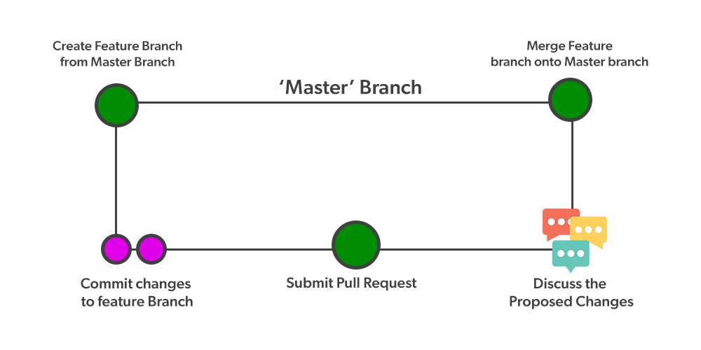

🔐 Phân quyền GitHub: main và branch

1️⃣ Nhánh main

Đây là nhánh chính thức của dự án.

Luôn chứa code ổn định, đã qua review/test.

🚫 Sinh viên KHÔNG được commit trực tiếp vào main (tránh làm hỏng code).

👉 Quyền với main:

✅ Nhóm trưởng (Leader / Maintainer): có quyền merge pull request.

❌ Thành viên: không push trực tiếp, chỉ tạo pull request.

2️⃣ Nhánh branch (nhánh phụ)

Mỗi thành viên sẽ tạo branch riêng để phát triển tính năng hoặc sửa lỗi.

Ví dụ:

git checkout -b feature/login
git checkout -b bugfix/database-error

Sau khi code xong → push branch lên GitHub → tạo Pull Request (PR) để xin merge vào main.

👉 Quyền với branch:

✅ Tất cả thành viên có thể tạo branch mới từ main.

✅ Mỗi branch gắn với 1 chức năng (feature) hoặc 1 nhiệm vụ (task).

3️⃣ Quy trình làm việc nhóm chuẩn

Clone repo về máy:

git clone https://github.com/vancv43/profile.git
cd profile

Tạo branch riêng:

git checkout -b feature/yourname-task

Commit & Push lên GitHub:

git add .
git commit -m "Hoàn thành chức năng login"
git push origin feature/yourname-task

Tạo Pull Request (PR) trên GitHub:

So sánh feature/yourname-task → main

Nhóm trưởng review, nếu ok thì merge.

4️⃣ Thiết lập phân quyền trong GitHub

Vào repo GitHub → Settings → Branches.

Tạo Branch Protection Rule cho main:

✅ Require pull request before merging (bắt buộc PR)

✅ Require approvals (yêu cầu leader approve trước khi merge)

✅ Restrict who can push to matching branches (chỉ cho leader push trực tiếp vào main).

📌 Minh họa quy trình
Thành viên → Tạo branch → Commit/Push → Pull Request → Leader Review → Merge vào main

👉 Như vậy:

main = code sạch, ổn định ✅

branch = nơi phát triển, thử nghiệm 🔧

Minh họa sơ đồ : 
